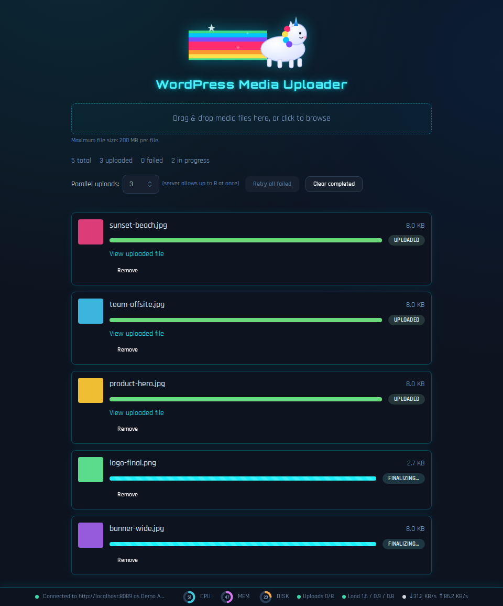

# WordPress Media Uploader

A local web app for uploading multiple media files to your WordPress site in parallel, via the WordPress REST API.



## Setup

1. Install dependencies:

   ```
   npm install
   ```

2. In WordPress, create an Application Password: **wp-admin → Users → Profile → Application Passwords**. Give it a name (e.g. "media uploader") and copy the generated password (it includes spaces — keep them).

3. Configure the server:

   ```
   cp server/.env.example server/.env
   ```

   Edit `server/.env` and set `WP_URL`, `WP_USERNAME`, `WP_APP_PASSWORD`, and a login for the app itself: `AUTH_USERNAME` / `AUTH_PASSWORD` (pick a long, random password — this is what stands between the internet and your WordPress site if you expose this app publicly).

## Run in development

```
npm run dev
```

This starts the Express API on `http://localhost:3001` and the Vite dev server on `http://localhost:5173` (which proxies `/api` requests to the backend). Open `http://localhost:5173`.

Note: in this mode, login is only enforced on the `/api/*` calls (proxied to Express), not on the page itself (served directly by Vite). Use `npm run serve` instead — see below — for anything other than local development on your own machine, since that's the mode where the whole app, including the initial page load, is behind login.

## Run as a single local app

```
npm run serve
```

Builds the React app and starts the Express server, which serves both the UI and the API from one process on `http://localhost:3001` (port configurable via `PORT` in `.env`). `npm run build` and `npm run start` remain available separately if you only need one of the two steps (e.g. re-running the server without rebuilding).

## Run with Docker

A pre-built image is published to GHCR on every merge to `master`: [`ghcr.io/micdah/wp-upload`](https://github.com/micdah/wp-upload/pkgs/container/wp-upload). Pull `:latest` or a specific version tag (e.g. `:1.2.3`) instead of building locally:

```
docker run -d -p 3001:3001 \
  -e WP_URL=https://example.com \
  -e WP_USERNAME=your-username \
  -e WP_APP_PASSWORD="xxxx xxxx xxxx xxxx xxxx xxxx" \
  -e AUTH_USERNAME=admin \
  -e AUTH_PASSWORD=change-me-to-something-long-and-random \
  ghcr.io/micdah/wp-upload:latest
```

If you'd rather build it yourself (e.g. to test local changes), the `Dockerfile` still works the same way:

```
docker build -t wp-upload .
docker run -d -p 3001:3001 \
  -e WP_URL=https://example.com \
  -e WP_USERNAME=your-username \
  -e WP_APP_PASSWORD="xxxx xxxx xxxx xxxx xxxx xxxx" \
  -e AUTH_USERNAME=admin \
  -e AUTH_PASSWORD=change-me-to-something-long-and-random \
  wp-upload
```

The image is a multi-stage build ending on `gcr.io/distroless/nodejs22-debian12:nonroot` — no shell, no package manager, and the process runs as a non-root user (UID 65532). There's no `.env` file inside the image; every variable in `server/.env.example` (`WP_URL`, `WP_USERNAME`, `WP_APP_PASSWORD`, `AUTH_USERNAME`, `AUTH_PASSWORD`, and the optional `HOST`/`PORT`/`UPLOAD_CONCURRENCY`/`MAX_FILE_SIZE_MB`/`WP_REQUEST_TIMEOUT_MS`/`TRUST_PROXY`) is passed in via `-e` (or your orchestrator's env/secret mechanism) instead. `PORT` defaults to `3001` and `HOST` to `0.0.0.0` inside the container already, so you generally only need to set `-p <host-port>:3001` to match.

A `GET /healthz` route (no login required) is available for container/orchestrator health checks — it just confirms the process is up, without touching WordPress or requiring credentials.

### Using docker compose

`docker-compose.yml` pulls the **pre-built** [`ghcr.io/micdah/wp-upload:latest`](https://github.com/micdah/wp-upload/pkgs/container/wp-upload) image (it doesn't build one itself) and passes every setting through explicit `environment:` entries, filled in by Compose from a root-level `.env` file:

```
cp server/.env.example .env   # a root-level .env for compose - separate from server/.env
docker compose up -d
```

That root `.env` is read by Compose itself for the `${VAR}` substitutions in `docker-compose.yml` — it's a different file from `server/.env` (used by the non-Docker `npm run` flows above), but takes the same variable names. Already covered by `.gitignore`. Run `docker compose pull && docker compose up -d` whenever you want to update to the latest published image. If you're testing local changes instead, set `image: wp-upload:latest` in `docker-compose.yml`, `docker build -t wp-upload:latest .`, then `docker compose up -d`.

## Accessing from another device on your network

By default both the Express server and the Vite dev server bind to all network interfaces, so the app is also reachable at `http://<this-machine's-LAN-IP>:3001` (production) or `:5173` (dev). Set `HOST=127.0.0.1` in `server/.env` if you want to restrict it back to this machine only.

## Exposing this publicly

The app is protected by a login (HTTP Basic Auth, checked against `AUTH_USERNAME`/`AUTH_PASSWORD`) covering every route, with a lockout after 10 failed attempts from the same IP within 5 minutes. That login is the only thing standing between the internet and your WordPress credentials, so before putting this on the open internet:

- **Always put a TLS-terminating reverse proxy in front of it** (nginx, Caddy, Cloudflare Tunnel, your hosting platform's load balancer, etc.) pointed at this app's port over plain HTTP on localhost/an internal network. This app does not terminate HTTPS itself. Basic Auth credentials are base64-encoded, not encrypted — sent over plain HTTP, they're as good as sent in cleartext.
- **Only run it via `npm run serve`** (single origin, both UI and API behind login) for anything public-facing — never `npm run dev`.
- **Set `TRUST_PROXY=true` only if** the reverse proxy in front of it is one you control and it overwrites (not appends to) the `X-Forwarded-For` header itself. Otherwise leave it `false` — enabling it without a proxy that behaves this way lets any client fake their IP and bypass the login rate limit entirely.
- Use a long, random `AUTH_PASSWORD` — it's a shared secret with no username enumeration protection beyond the lockout.

## Notes

- Credentials are only ever stored server-side in `server/.env` — the browser never sees them.
- Changes to `.env` require restarting the server (`npm run dev` / `npm run start`).
- Parallel upload count is adjustable in the UI (capped at the server's `UPLOAD_CONCURRENCY`) and remembered in the browser.
- `WP_REQUEST_TIMEOUT_MS` (default 5 minutes) bounds how long the server waits on each WordPress upload request before giving up. It's set well above a normal network round trip because WordPress keeps the connection open while it generates scaled-down image versions after receiving the file, which can take a while under many parallel uploads.
